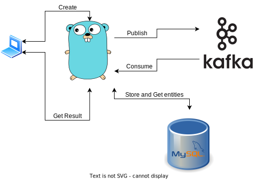
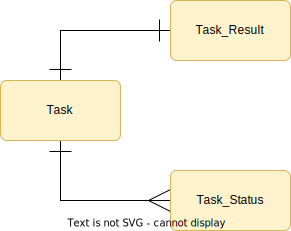

### Summery

This is an async request sender that takes an http request from an http endpoint and send the request and then expose the results and status in the second endpoint. Project-Structure is DDD.



### Database Schema



| Dependencies                                                |
| ----------------------------------------------------------- |
| [oapi-codegen](https://github.com/deepmap/oapi-codegen)     |
| [taskfile](https://taskfile.dev/)                           |
| [mockery](https://github.com/vektra/mockery)                |
| [golang-migrate](https://github.com/golang-migrate/migrate) |

Configs are in .env but for docker container some overwrites exists in ./dep/.env

### Install Dependencies

``` bash
go install github.com/deepmap/oapi-codegen/v2/cmd/oapi-codegen@latest
```

``` bash
go get -u github.com/deepmap/oapi-codegen/v2/cmd/oapi-codegen
```

``` bash
brew install go-task
```

``` bash
go install github.com/vektra/mockery/v2@v2.38.0
```

``` bash
brew install mockery
```

``` bash
brew install golang-migrate
```

### Run

``` bash
task dep-up
```

``` bash
task run
```

### Testing

There are both mocked and integration tests in this project, implemented by mockery and testcontainer

### future
dead letter queue for missed requests